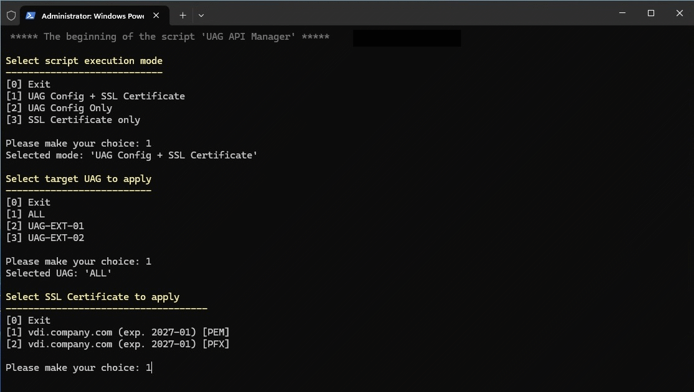
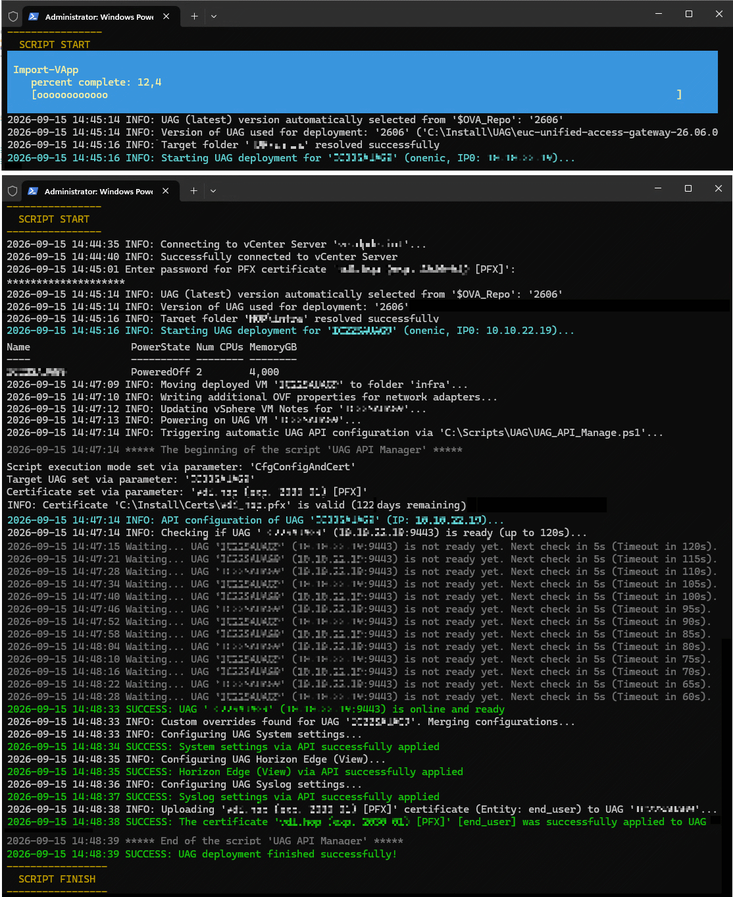

# **Omnissa Unified Access Gateway (UAG) Automation**

A lightweight, production-ready PowerShell toolkit for automated deployment and centralized REST API configuration management of Omnissa Unified Access Gateway (UAG) appliances.

## **Overview**

This toolkit streamlines appliance deployment and ongoing REST API configuration management of Omnissa UAG appliances using native PowerShell, keeping all credentials securely protected via Windows DPAPI.

### **Key Features**

* **Automated OVA Deployment**: Automated provisioning using native PowerShell/PowerCLI without external tools (no VMware OVF Tool required).  
* **Centralized & Bulk Management**: Deploy a single appliance or configure multiple UAGs simultaneously with support for global baselines and per-appliance overrides via REST API.  
* **DPAPI Credential Security**: Administrator passwords and RADIUS shared secrets are encrypted locally using Windows Data Protection API (DPAPI) and purged from memory after execution—no plaintext secrets in configuration files.  
* **Structured Infrastructure Placement**: Automated target folder placement, Resource Pools, and VM annotations during provisioning.  
* **Pre-Deployment Policy Validation**: Validates password complexity against appliance security policies *before* initiating import to prevent deploying unbootable appliances.  
* **Independent Lifecycle Operations**: Reconfigure settings, update RADIUS/SAML, or renew SSL certificates at any time via REST API without redeploying appliances.

Validated on UAG versions 2512\+

## **File Structure**
```
├── cfg_UAG_Template.ps1    # Inventory, baseline settings, and per-appliance overrides  
├── UAG_API_Manage.ps1      # Centralized REST API configuration & cert management  
└── UAG_Deploy.ps1          # Appliance OVA deployment and provisioning  
```
## **Prerequisites**

* **PowerShell**: 5.1 or 7+  
* **Deployment Module**: VMware.VimAutomation.Core (for vSphere deployment)  
* **Network Connectivity**: TCP port 9443 reachable to UAG management interfaces

## **Quick Start**

### **1\. Configure Inventory & Baseline Settings**

Copy cfg\_UAG\_Template.ps1 to cfg\_UAG.ps1 and define your UAG target appliances and configuration:

```powershell
$UAG = @(  
    @{ Name = "UAG-EXT-01"; IP = "10.0.10.11"; User = "admin" }
   ,@{ Name = "UAG-EXT-02"; IP = "10.0.10.12"; User = "admin" }
)

$CERTS = @{  
    "vdi.company.com (exp. 2027-01) [PFX]" = @{  
        CertType     = "PFX"  
        CertPfxPath  = "C:\Certs\vdi_company_com.pfx"  
        CertPfxAlias = ""  
        CertEntity   = @("end_user")  
    }  
}
```
* Global settings applied to all appliances are defined in $UAG\_CFG\["ALL"\].  
* Appliance-specific overrides can be defined under $UAG\_CFG["<ApplianceName\>"\].

### **2\. Automated Deployment (UAG\_Deploy.ps1)**

Configure your target platform settings, enable post-deployment automation flags in *\$UAG\_base*, and set the API orchestration block *\$UAG\_ApiCfg*:

```powershell

# Execution Switches 
$UagPowerOn = $true   # Automatically power on VM post-import
$UagConfig  = $true   # Trigger API management workflow upon boot

# Post-Deployment API Orchestration Settings
$UAG_ApiCfg = @{
    ScriptName = "UAG_API_Manage.ps1"
    SecCredUAG = "sec_uag_{0}_$($env:COMPUTERNAME)_$($env:USERNAME).txt"
    Params     = @{
        UagCfg   = "cfg_UAG.ps1"
        Mode     = "CfgConfigAndCert"  # CfgConfigOnly | CfgCertOnly | CfgConfigAndCert
        CertName = "vdi.company.com (exp. 2027-01) [PFX]"
    }
}
```

Run deploy script:
```powershell
.\UAG_Deploy.ps1
```
*Deploys the OVA, organizes the VM into the target structure, powers it on, secures credentials via DPAPI, and triggers automated API configuration.*

## **Ongoing Management (UAG\_API\_Manage.ps1)**

Use this script at any time to reconfigure UAG settings, update RADIUS/SAML, or renew SSL certificates across one or all appliances via REST API.

### **Interactive Menu**

Run without parameters to launch the guided interactive console:
```powershell
.\UAG_API_Manage.ps1
```
### **Silent & Bulk Operations (CLI)**

**Apply configuration only to a single appliance:**
```powershell
.\UAG_API_Manage.ps1 -Mode CfgConfigOnly -TargetUAG "UAG-EXT-01"
```
**Bulk apply configuration and certificate across ALL appliances:**
```powershell
.\UAG_API_Manage.ps1 -Mode CfgConfigAndCert -TargetUAG ALL -CertName "vdi.company.com (exp. 2027-01) [PFX]" -CertPfxPassword "SecretPass123"
```
**Bulk update SSL certificate only across ALL appliances:**
```powershell
# PFX Certificate  
.\UAG_API_Manage.ps1 -Mode CfgCertOnly -TargetUAG ALL -CertPfxPath "C:\Certs\vdi.pfx" -CertPfxPassword "SecretPass123"

# PEM Certificate Chain + Private Key (Dynamic CLI Upload)  
.\UAG_API_Manage.ps1 -Mode CfgCertOnly -TargetUAG ALL -CertPem "C:\Certs\cert.pem" -CertKeyPem "C:\Certs\key.pem"
```
### **CLI Parameters Reference**

| Parameter | Type / Values | Description |
| :---- | :---- | :---- |
| \-Mode | CfgConfigAndCert, CfgConfigOnly, CfgCertOnly | Execution scope for configuration, certificates, or both. |
| \-TargetUAG | ALL or \<UAG\_Name\> | Appliance filter matching $UAG inventory name. |
| \-UagCfg | File path | Path to configuration file (defaults to cfg\_UAG.ps1). |
| \-CertName | String | Certificate key name from $CERTS hash table. |
| \-CertType | PFX, PEM | Certificate format for dynamic CLI upload. |
| \-CertPfxPath | File path | Path to .pfx file for dynamic CLI upload. |
| \-CertPfxPassword | String | Password for .pfx file (mandatory in silent mode). |
| \-CertPfxAlias | String | Optional friendly alias inside the PKCS#12 container. |
| \-CertPem | File path | Path to full chain .pem certificate for dynamic CLI upload. |
| \-CertKeyPem | File path | Path to RSA private key .pem file for dynamic CLI upload. |
| \-CertEntity | end\_user, admin | Target listener entity (defaults to end\_user). |
| \-RadiusSecret | String | Primary RADIUS shared secret for non-interactive execution. |
| \-RadiusSecret2 | String | Secondary RADIUS shared secret for non-interactive execution. |

**Example of the script's execution**




## **Security Notes**

* Administrator credentials and RADIUS shared secrets are encrypted locally using Windows DPAPI tied to the local machine and user context.  
* DPAPI secrets are purged from memory immediately following execution.

## **Author & License**

* **Author**: Jan Fara ([@jfacz](https://github.com/jfacz))  
* **License**: MIT