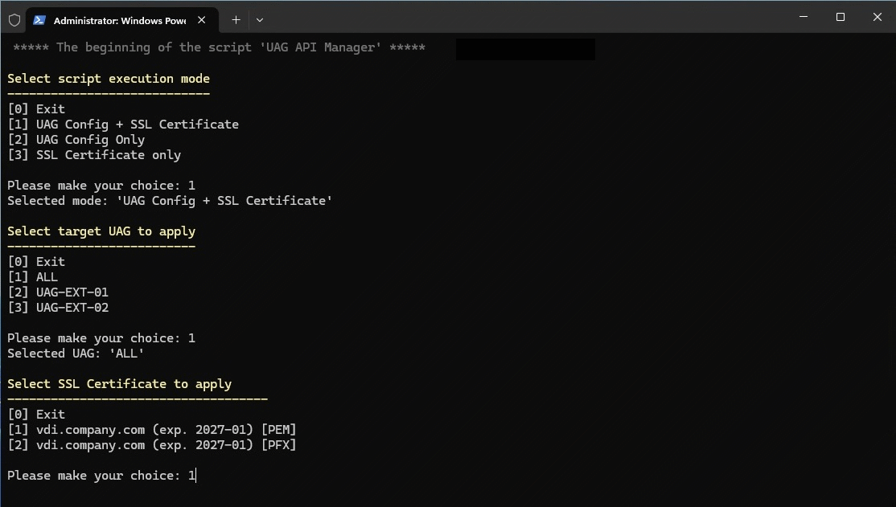
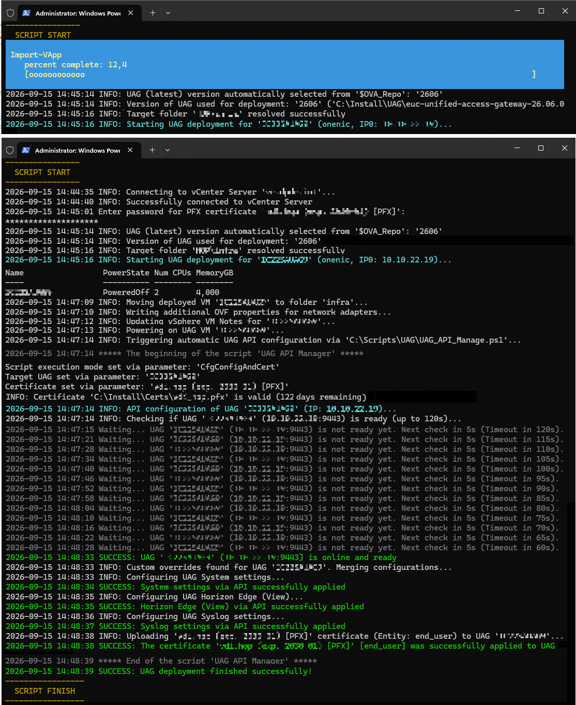

# **Omnissa Unified Access Gateway (UAG) Automation**

A lightweight, production-ready PowerShell toolkit for automated OVA deployment and centralized REST API configuration management of Omnissa Unified Access Gateway (UAG) appliances.

## **Overview**

Designed for enterprise multi-customer environments, this toolkit streamlines appliance lifecycle operations using native PowerShell while keeping all administrator credentials and shared secrets encrypted via Windows DPAPI.

It addresses two major operational challenges in UAG management:
1. **Frequent Appliance Redeployments**: Since UAG upgrades are performed by deploying fresh OVA instances rather than in-place patching, this toolkit fully automates the transition from OVA import to a fully configured, production-ready state.
2. **Shortened SSL Certificate Validity**: With certificate expiration cycles continuously shrinking, the toolkit enables bulk, non-disruptive SSL certificate renewals across appliance clusters via REST API, including seamless CLI integration with automated ACME clients (e.g., Posh-ACME).

The toolkit consists of two decoupled yet seamlessly integrated components:
* **Deployment (`UAG_Deploy.ps1`)**: Provisions VMs in vSphere (folder structure, Resource Pools, network, and IP settings) and can automatically initiate post-boot API configuration.
* **Lifecycle & Configuration (`UAG_API_Manage.ps1`)**: Manages Day-2 REST API operations (SAML/RADIUS, local monitoring users, SSL certificates) independently or as part of post-deployment orchestration.

---

### **Key Features**

* **Automated OVA Provisioning**: Native PowerShell/PowerCLI deployment without external tools (no OVF Tool required), including target folder placement, Resource Pool assignment, and VM annotations.
* **Centralized REST API Management**: Single or bulk appliance configuration using standard baseline templates (`cfg_UAG.ps1`) with per-appliance override support.
* **Non-Disruptive Lifecycle Operations**: Reconfigure system settings, update RADIUS/SAML IdPs, or renew SSL certificates (PFX/PEM) dynamically via REST API without redeploying VMs.
* **Local & Monitoring Account Management**: Automated creation and updating of local UAG user accounts (including dedicated `ROLE_MONITORING` users for NMS metrics via `/rest/v1/monitor/stats`).
* **Enterprise DPAPI Credential Security**: Admin passwords and RADIUS shared secrets are encrypted locally via Windows DPAPI and purged from memory immediately post-execution—ensuring zero plaintext secrets in configuration files.
* **Pre-Flight Safety Validation**: Validates password complexity against appliance security policies and checks SSL/SAML metadata expiration *before* deployment to prevent invalid configurations.

Validated on UAG versions 2512+

---

## **File Structure**

```text
├── cfg_UAG.ps1            # Active inventory, baseline settings, and per-appliance overrides
├── cfg_UAG_Template.ps1   # Template configuration file with all supported properties
├── UAG_Deploy.ps1         # vSphere OVA deployment & automated post-boot orchestration
└── UAG_API_Manage.ps1     # Centralized REST API configuration & SSL cert management
```
## **Prerequisites**

* **PowerShell**: 5.1 or 7+  
* **Deployment Module**: VMware.VimAutomation.Core (required for vSphere deployment via UAG_Deploy.ps1)  
* **Network Connectivity**: TCP port 9443 reachable to UAG management interfaces

## **Quick Start**

### **1\. Configure UAG Inventory & Baseline Settings [`cfg_UAG.ps1`]**

Global settings applied to all appliances are defined in `$UAG_CFG["ALL"]`.  

Copy `cfg_UAG_Template.ps1` to `cfg_UAG.ps1` and define your target appliances, SSL certificates, and baseline configuration:

```powershell
# List of target UAG appliances
$UAG = @(  
    @{ Name = "UAG-EXT-01"; IP = "10.0.10.11"; User = "admin" }
   ,@{ Name = "UAG-EXT-02"; IP = "10.0.10.12"; User = "admin" }
)

# SSL Certificate definitions (PFX or PEM)
$CERTS = @{  
    "vdi.company.com (exp. 2027-01) [PFX]" = @{  
        CertType     = "PFX"  
        CertPfxPath  = "C:\Certs\vdi_company_com.pfx"  
        CertPfxAlias = ""  
        CertEntity   = @("end_user")  
    }  
}

# Global baseline configuration applied to all UAGs
$UAG_CFG["ALL"] = @{
    #  System & General Settings
    systemSettings = @{
        dns                                     = "10.0.1.10 10.0.1.11"
        dnsSearch                               = "company.com"
        ntpServers                              = "10.0.1.10 10.0.1.11"
        ceipEnabled                             = $false
    }
    adminUsers = @{
        "monitoring" = @{
            name                              = "monitoring"
            password                          = "VDI!Moni70ring" # Requires all 4 character classes
            enabled                           = $true
            roles                             = @("ROLE_MONITORING")
            userType                          = "INTERNAL"
            adminMonitoringPasswordPreExpired = $false
        }
    }
}
```

**Per-Appliance Overrides:** Define custom settings for specific appliances (e.g., distinct host entries or SAML IdPs) under `$UAG_CFG["<ApplianceName>"]`:

```powershell
$UAG_CFG["UAG-EXT-01"] = @{
    edgeService = @{ hostEntries = @("10.0.10.50 vdi.company.com") }
}
```

### **2\. Automated Deployment [`UAG_Deploy.ps1`]**

Configure your target platform settings, enable post-deployment automation flags in `$UAG_base`, and set the API orchestration block `$UAG_ApiCfg`:

```powershell

# Execution Switches 
$UagPowerOn = $true   # Automatically power on VM post-import
$UagConfig  = $true   # Trigger API management workflow upon boot

# Post-Deployment API Orchestration Settings
$UAG_ApiCfg = @{
    ScriptName = "UAG_API_Manage.ps1"
    SecCredUAG = "sec_uag_{0}_$($env:COMPUTERNAME)_$($env:USERNAME).txt"
    Params     = @{
        UagCfg   = "cfg_UAG.ps1"
        Mode     = "CfgConfigAndCert"  # CfgConfigOnly | CfgCertOnly | CfgConfigAndCert
        CertName = "vdi.company.com (exp. 2027-01) [PFX]"
    }
}
```

Run deploy script:
```powershell
.\UAG_Deploy.ps1
```
*Deploys the OVA, places the VM in the target vSphere structure, powers it on, waits for port 9443 readiness, and triggers automated REST API configuration.*

## **UAG API Management [`UAG_API_Manage.ps1`]**

Use this script at any time to reconfigure UAG settings, update RADIUS/SAML, or renew SSL certificates across one or all appliances via REST API.

### **Interactive Console Mode**

Run without parameters to launch the guided console menu:
```powershell
.\UAG_API_Manage.ps1
```
### **CLI & Automation Mode (Silent Execution)**

**Apply configuration only to a single appliance:**
```powershell
.\UAG_API_Manage.ps1 -Mode CfgConfigOnly -TargetUAG "UAG-EXT-01"
```
**Bulk apply configuration and certificate across ALL appliances:**
```powershell
.\UAG_API_Manage.ps1 -Mode CfgConfigAndCert -TargetUAG ALL -CertName "vdi.company.com (exp. 2027-01) [PFX]" -CertPfxPassword "SecretPass123"
```
**Bulk upload SSL certificate only (ACME renewal hook compatible):**
```powershell
# PFX Certificate upload 
.\UAG_API_Manage.ps1 -Mode CfgCertOnly -TargetUAG ALL -CertPfxPath "C:\Certs\vdi.pfx" -CertPfxPassword "SecretPass123"

# PEM Certificate Chain + Private Key (Dynamic CLI upload) 
.\UAG_API_Manage.ps1 -Mode CfgCertOnly -TargetUAG ALL -CertPem "C:\Certs\cert.pem" -CertKeyPem "C:\Certs\key.pem"
```
### **CLI Parameters Reference**

| Parameter | Type / Values | Description |
| :---- | :---- | :---- |
| \-Mode | CfgConfigAndCert, CfgConfigOnly, CfgCertOnly | Execution scope for configuration, certificates, or both. |
| \-TargetUAG | ALL or \<UAG\_Name\> | Appliance filter matching $UAG inventory name. |
| \-UagCfg | File path | Path to configuration file (defaults to cfg\_UAG.ps1). |
| \-CertName | String | Certificate key name from $CERTS hash table. |
| \-CertType | PFX, PEM | Certificate format for dynamic CLI upload. |
| \-CertPfxPath | File path | Path to .pfx file for dynamic CLI upload. |
| \-CertPfxPassword | String | Password for .pfx file (mandatory in silent mode). |
| \-CertPfxAlias | String | Optional friendly alias inside the PKCS#12 container. |
| \-CertPem | File path | Path to full chain .pem certificate for dynamic CLI upload. |
| \-CertKeyPem | File path | Path to RSA private key .pem file for dynamic CLI upload. |
| \-CertEntity | end\_user, admin | Target listener entity (defaults to end\_user). |
| \-RadiusSecret | String | Primary RADIUS shared secret for non-interactive execution. |
| \-RadiusSecret2 | String | Secondary RADIUS shared secret for non-interactive execution. |

### Example of the script's execution




### Troubleshooting and Common Issues
* **DPAPI Credential Decryption Errors**
    * _.txt_ credential files generated by DPAPI are bound to the specific Windows user account and computer context.
    * If executing under a scheduled task or a different user account, re-run the script interactively under that context to generate a valid DPAPI secret file, or delete the existing file to reset it.

* **HTTP 400 Bad Request on User Creation** (`adminUsers`):
    * UAG REST API enforces passwords containing all 4 character classes (uppercase, lowercase, digits, and special characters) with a minimum length of 8 characters.
    * Avoid problematic characters in local passwords such as +, spaces, =, or quotes as they are rejected by the UAG backend validator.

* **UAG Management API Unreachable (Port 9443)**
    * Ensure TCP port 9443 is allowed through firewalls between the execution host and UAG interfaces.
    * Post-deployment, UAG daemons typically require 1 to 3 minutes after initial boot before port 9443 starts accepting REST API connections.

* **HTTP 400 Bad Request when Accessing Port 9443 via Hostname**
    * Occurs when accessing UAG via hostname while IP access works. Ensure the Allow Host Header property in systemSettings matches your management FQDN.

### API Documentation & Resources
Interactive UAG Swagger UI is available directly on deployed appliances:
`https://<UAG-IP>:9443/swagger-ui/index.html`

* [Omnissa UAG REST API Documentation](https://developer.omnissa.com/uag-rest-apis/getting-started-guide)
* [Omnissa Developer Portal](https://developer.omnissa.com)
* [Broadcom VMware PowerCLI Documentation](https://developer.omnissa.com)

## **Security Notes**

* Administrator credentials and RADIUS shared secrets are encrypted locally using Windows DPAPI tied to the local machine and user context.  
* DPAPI secrets are purged from memory immediately following execution.

## **Author & License**

* **Author**: Jan Fara ([@jfacz](https://github.com/jfacz))  
* **License**: MIT